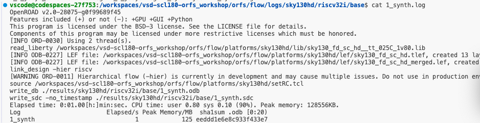
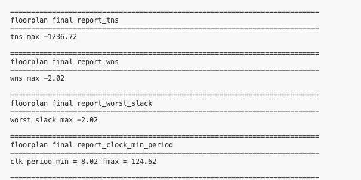
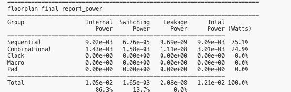
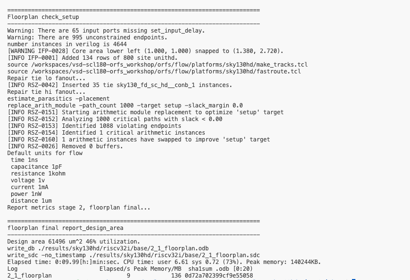

# Phase 1 - ORFS Execution in GitHub Codespaces

## Scope
Run ORFS in GitHub Codespaces and execute flow progress through floorplan.

## Concept Note: Single Wrapper Flow vs ORFS
A wrapper flow is a controller layer that hides multiple EDA tool steps behind one command and manages all intermediate handoffs automatically.

### OpenLane (single wrapper)
- Typical usage: one command such as `flow.tcl -design <design_name>`.
- Internally runs synthesis, floorplan, placement, CTS, routing, timing, signoff, and final GDS.
- Good for learning overall flow outcome quickly, but internal stage-level control is limited.

### ORFS (modular flow)
- Exposes stage scripts and stage-wise execution through `make` targets.
- Typical progression is visible as synthesis -> floorplan -> placement -> CTS -> routing -> signoff.
- Better for debugging, parameter tuning, and understanding exactly which stage fails or regresses.

### Why this matters in Week-2
Week-2 transitions from black-box execution to flow ownership: instead of only knowing start/end, we inspect and control each physical design stage.

## Stage/Tool Mapping (Practical View)
| Stage | Main Tool |
|---|---|
| Synthesis | Yosys |
| Floorplan | OpenROAD |
| Placement | OpenROAD |
| CTS | TritonCTS (inside OpenROAD) |
| Routing | TritonRoute/FastRoute (inside OpenROAD flow) |
| Timing | OpenSTA (inside OpenROAD flow) |

## Completed Work
1. Forked upstream repository and launched Codespaces.
2. Verified workspace structure in root (`README.md`, `images`, `orfs`).
3. Verified OpenROAD availability and version in Codespaces.
4. Prepared SCL180 platform files (LEF/GDS/LIB and liberty filtering).
5. Started flow run and reached floorplan milestone.

## Task 1.1 — Repository Setup

### Workspace and setup checks
Shows the top-level workspace structure with `README.md`, `images`, and `orfs`.


Shows ORFS directory contents, including flow scripts and setup/build files.


Confirms OpenROAD is installed and runnable in the Codespaces environment.


Confirms Yosys is available for synthesis in the same environment.


Confirms Python runtime version used by ORFS utility scripts.


Confirms GNU Make version used to orchestrate flow stages.


### Synthesis and floorplan stage evidence

Shows `1_synth.log` output, proving synthesis completed and reports were generated.

Shows floorplan timing metrics including TNS, WNS, worst slack, and derived fmax.

Shows floorplan power breakdown across sequential and combinational logic.

Shows floorplan checks, warnings, and design area/utilization summary.

Shows synthesized chip area of top module `riscv` and sequential contribution.

Shows a mapped netlist excerpt using sky130 standard cells after synthesis.

## Extracted Values From Uploaded Screenshots
### Environment checks
- `openroad -version`: `v2.0-28075-g0f99689f45`
- `yosys -V`: `Yosys 0.58+94`
- `python3 --version`: `Python 3.10.12`
- `make --version`: `GNU Make 4.3`

### Synthesis and floorplan evidence
- Synthesis stage log (`1_synth.log`) is present and completed.
- Floorplan timing snapshot:
  - `tns max = -1236.72`
  - `wns max = -2.02`
  - `worst slack max = -2.02`
  - `clk period_min = 8.02`, `fmax = 124.62`
- Floorplan power snapshot:
  - Total power: `1.21e-02 W`
  - Sequential share: `75.1%`
  - Combinational share: `24.9%`
- Floorplan/check setup snapshot:
  - Warning: `65 input ports missing set_input_delay`
  - Warning: `995 unconstrained endpoints`
  - Instances in design: `4644`
  - Design area: `61496 um^2`
  - Utilization: `46%`

## Current Phase 1 Status
- Codespaces setup: Completed.
- Tool invocation checks: Completed.
- Flow execution: Completed up to floorplan with timing/power/area evidence captured from screenshots.
- Remaining in phase: collect explicit floorplan log snippet and continue to placement/CTS/routing/final reports.

## Troubleshooting Note: `openroad` Not Found
Codespace name is not the root cause; missing OpenROAD is usually an install/path issue.

1. Confirm you are in container/workspace:
```bash
cat /etc/os-release
pwd
```

2. Check whether `.devcontainer/Dockerfile` actually installs OpenROAD:
```bash
grep -nEi "openroad|install-openroad" .devcontainer/Dockerfile
```

3. Check whether binary exists on disk:
```bash
find / -type f -name openroad 2>/dev/null | head -n 10
```

4. If found outside PATH, export PATH to the actual binary directory.

5. Validate dependencies:
```bash
ldd /usr/local/bin/openroad | grep "not found" || true
```

6. If binary is missing, run install script from repo root:
```bash
bash .devcontainer/install-openroad.sh
```

## Pending Additions
```bash
cd orfs/flow
find logs -type f | grep -i floorplan
# less logs/<platform>/<design>/<variant>/2_1_floorplan.log
```
