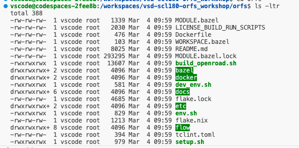
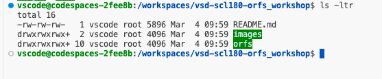
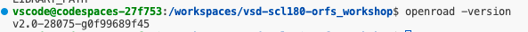
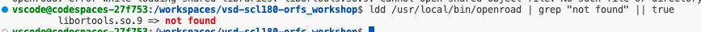
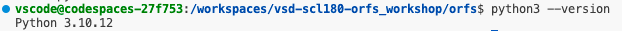
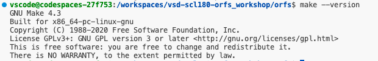
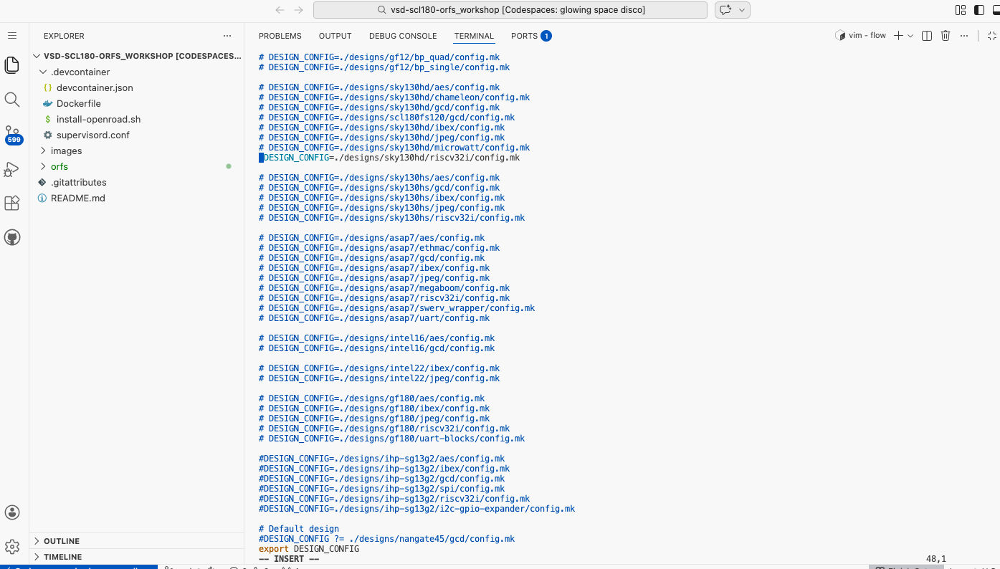
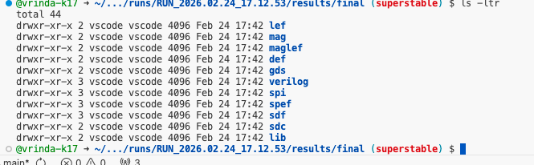
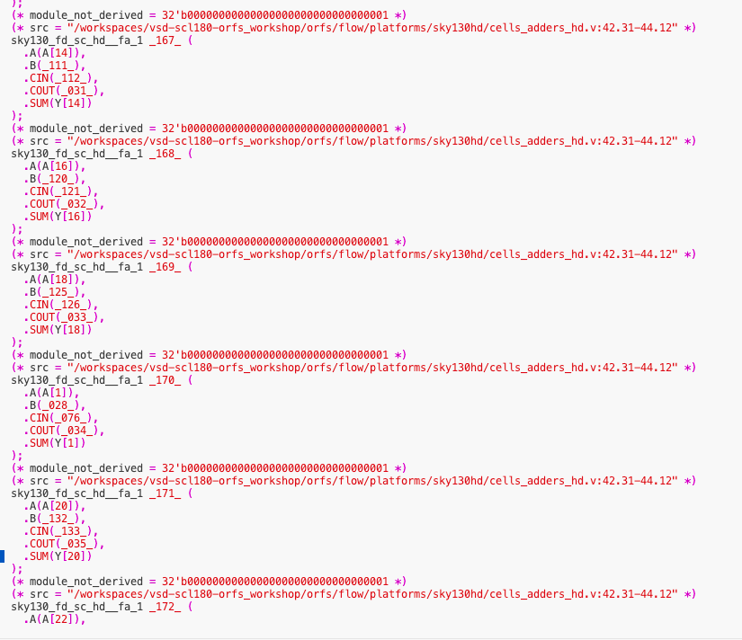

# Phase 2 - Toolchain Understanding (Devcontainer Deep Dive)

## Scope
Document the ORFS toolchain from `.devcontainer/Dockerfile` and `.devcontainer/install-openroad.sh`, and explain how ORFS stages connect.

## Source Files Reviewed
- `.devcontainer/Dockerfile`
- `.devcontainer/install-openroad.sh`

## Toolchain Mapping
| Tool | Installed From | Purpose in Flow | Stage Used |
|---|---|---|---|
| OpenROAD | Prebuilt binary from repo (`orfs/tools/openroad/bin/openroad`), installed by `install-openroad.sh` | Physical design engine and timing-driven optimization | Floorplan, place, CTS, route, timing closure, final GDS |
| Yosys | OSS CAD Suite archive from YosysHQ release | RTL synthesis to gate-level netlist | Synthesis |
| TritonCTS | Included inside OpenROAD build | Clock tree synthesis | CTS |
| FastRoute | Included inside OpenROAD build | Global routing | Routing |
| OpenSTA | Included inside OpenROAD build | Static timing analysis | Post-synth and post-PnR timing checks |
| KLayout | `.deb` package downloaded from `klayout.org` | Layout visualization and GDS inspection | Final layout review |
| Python3 | Ubuntu apt packages | Flow utilities, reporting, scripts | Utility/reporting across stages |
| Make | Ubuntu apt package | Flow orchestration entrypoint | All stages via Make targets |
| Git | Ubuntu apt package + Git LFS | Repository/version/data checkout (including LFS binaries) | Setup and environment preparation |

## Key Technical Notes From Setup Scripts
1. The container base is Ubuntu 22.04 with non-interactive apt.
2. GUI stack is preinstalled (Xfce + `x11vnc` + `novnc` + `websockify`) for browser-based layout viewing.
3. `install-openroad.sh` runs `git lfs pull` before installing OpenROAD to ensure binary artifacts are fetched.
4. Script validates shared libraries with:
```bash
ldd /usr/local/bin/openroad | grep -q 'not found'
```
5. If no missing libraries are found, OpenROAD version check is executed.

## Architecture Explanation (Own Words)
1. ORFS automates the full RTL-to-GDS pipeline by defining stage scripts and target dependencies.
2. `make` acts as the stage orchestrator: it calls synthesis, floorplan, placement, CTS, routing, and report targets in order.
3. Synthesis boundary is where RTL is converted into a gate-level netlist; after that, physical design begins (floorplan onward).
4. Timing is checked multiple times (synthesis outputs and post-physical stages) using OpenSTA within OpenROAD flow scripts.
5. Final GDS is produced at the end of physical implementation and can be viewed with KLayout.

## Relevant Evidence From Shared Screenshots
1. `ls -ltr` in root confirms expected top-level structure (`README.md`, `images`, `orfs`).
2. `ls -ltr` inside `orfs` confirms presence of flow scripts and build helpers (`build_openroad.sh`, `dev_env.sh`, `setup.sh`).
3. `ldd /usr/local/bin/openroad | grep "not found" || true` shows dependency validation check in use.
4. `openroad -version` screenshot confirms executable availability in the Codespaces environment.
5. `yosys -V`, `python3 --version`, and `make --version` screenshots provide direct tool version evidence.
6. Design-config editor screenshot confirms ORFS `DESIGN_CONFIG` options are available and switchable.
7. `results/final` listing screenshot confirms artifact classes expected from flow output.
8. Netlist/library screenshot provides implementation-level evidence of mapped cell instances.

## Screenshot Evidence
### Toolchain environment evidence








### Flow artifact and config evidence




## Version Evidence (From Uploaded Screenshots)
| Tool | Observed Version |
|---|---|
| OpenROAD | `v2.0-28075-g0f99689f45` |
| Yosys | `0.58+94` |
| Python | `3.10.12` |
| GNU Make | `4.3` |

## Output Artifact Evidence (From Uploaded Screenshots)
`results/final` includes the expected implementation outputs:
- `lef`
- `def`
- `gds`
- `verilog`
- `sdf`
- `spef`
- `spi`
- `lib`
- `mag`
- `maglef`
- `sdc`

## Status
- Tool inventory: Completed.
- Source and install path mapping: Completed.
- Architecture explanation: Completed.
- Version-pinned tool evidence: Added from uploaded screenshots.
- Next in Phase 2: add direct screenshot files into repo `docs/phase2/` if you want inline image rendering in GitHub.
