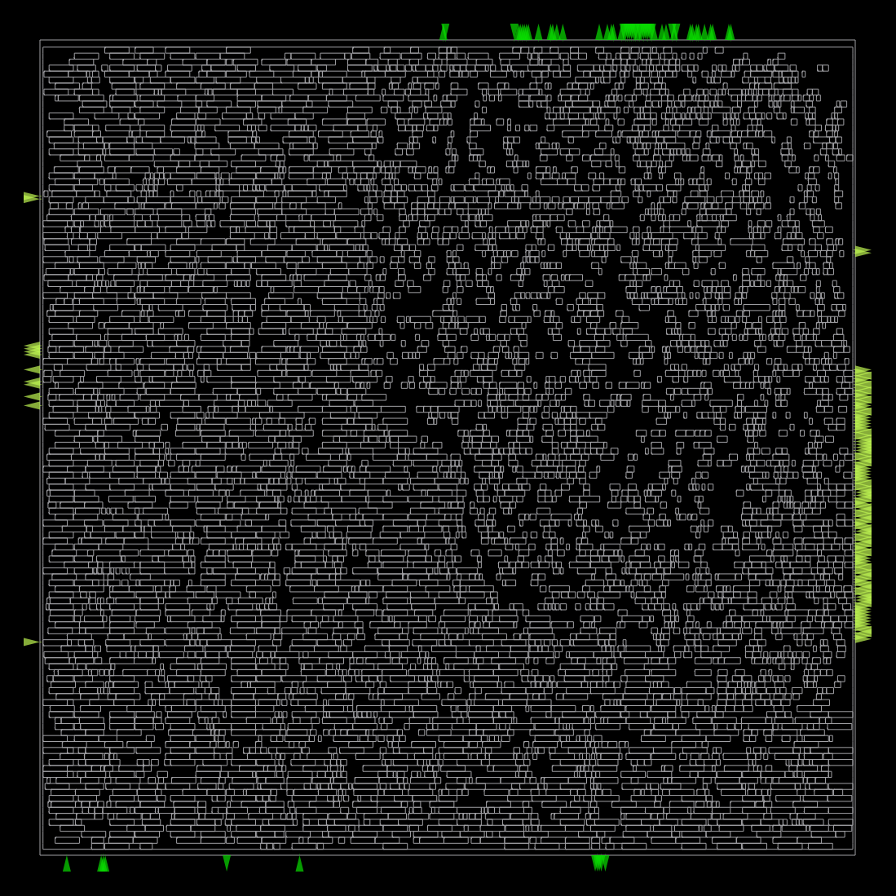
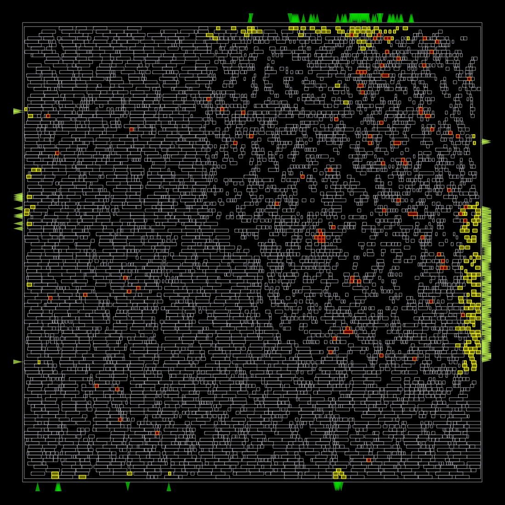
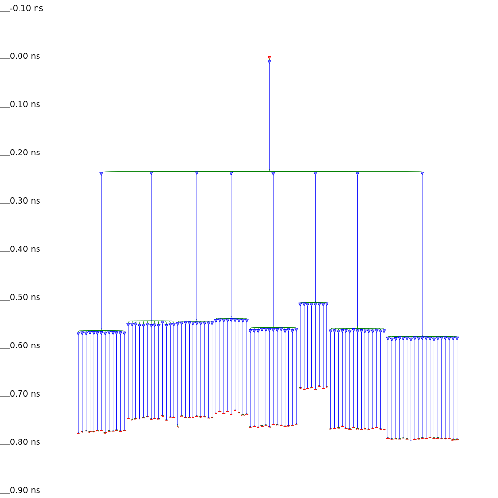
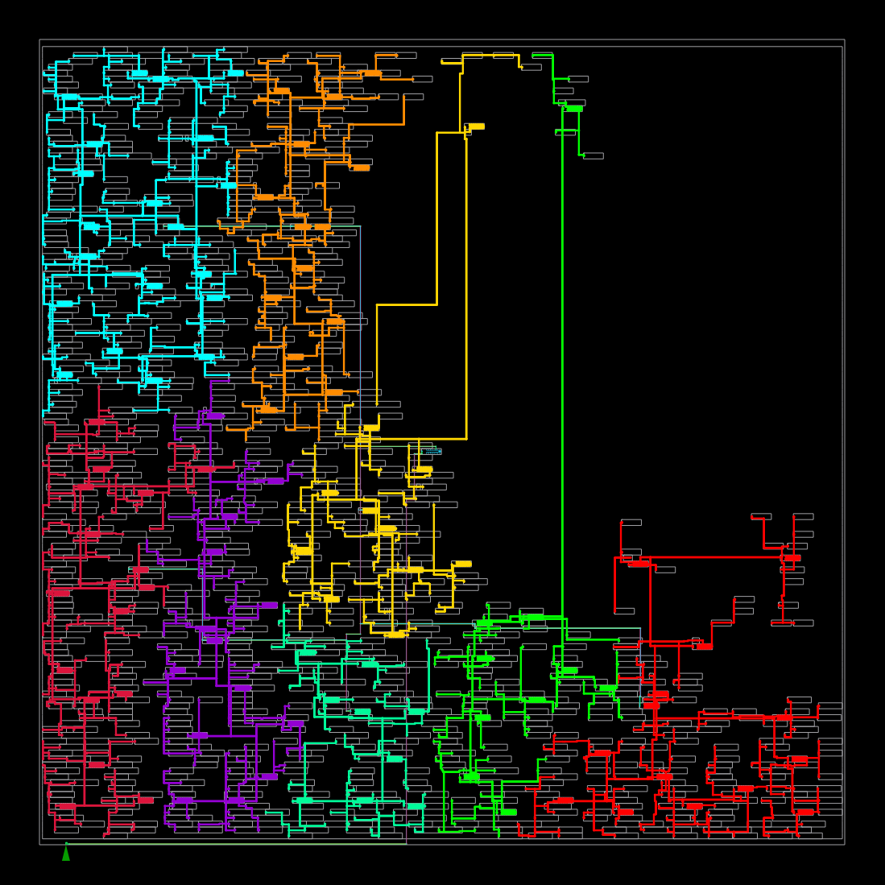
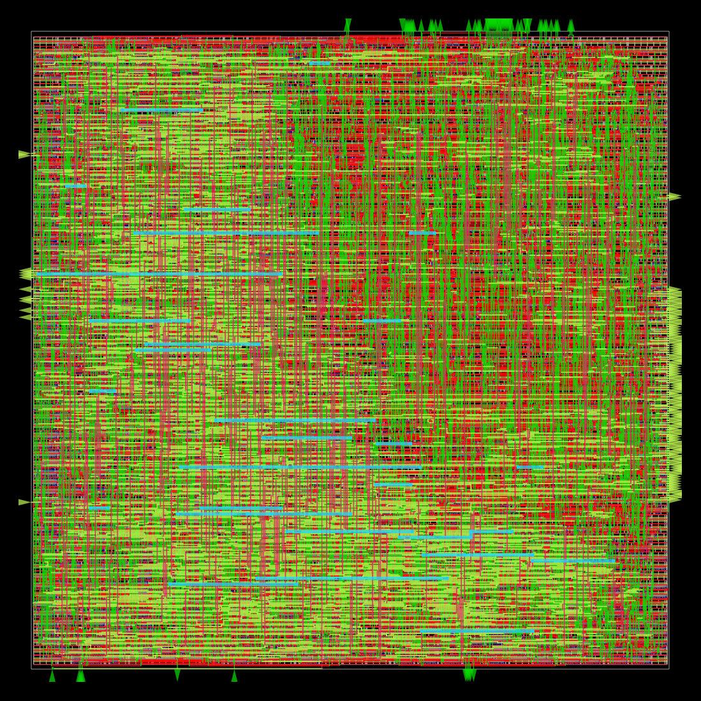
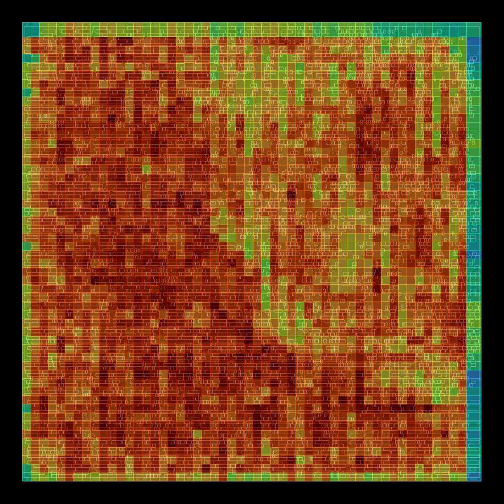
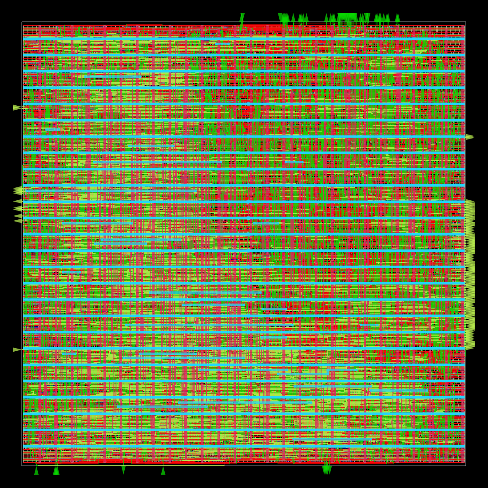
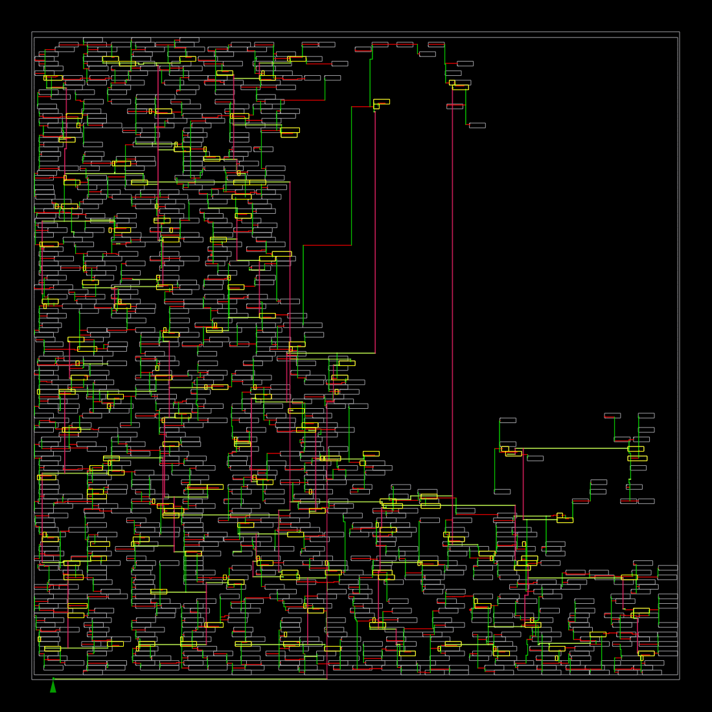
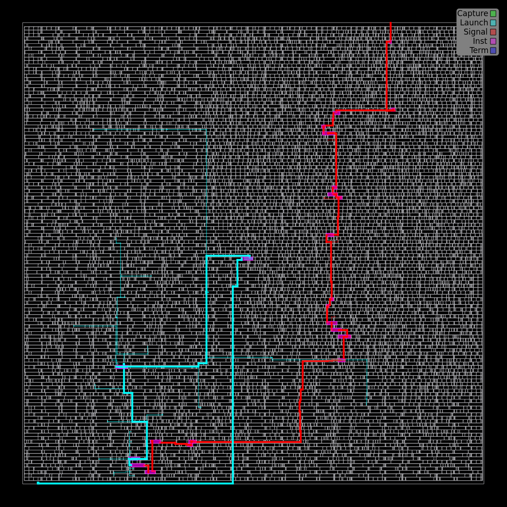
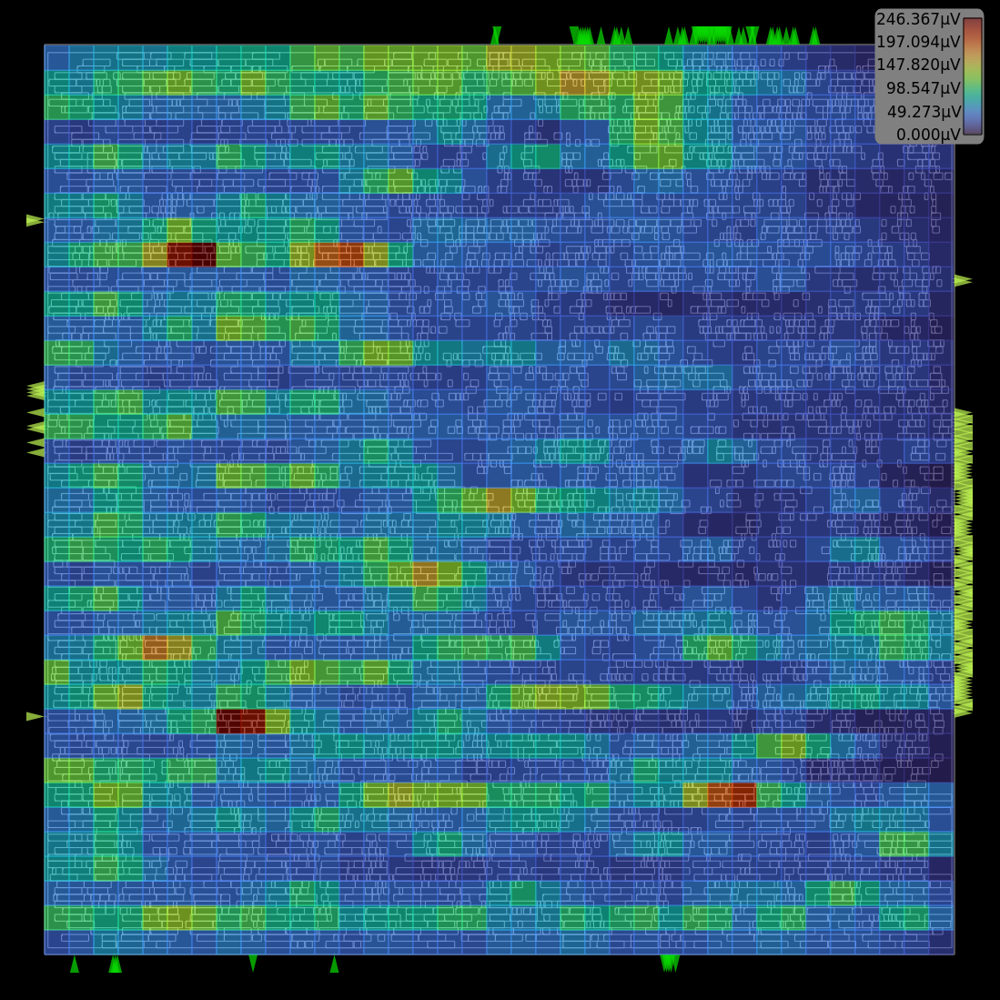

# Phase 3 — Full RTL-to-GDS Flow Implementation Report

**Design:** RISC-V (`riscv`)
**Platform:** sky130hd
**Variant:** base
**Clock period:** 6 ns (target) | Tool: `clk`
**Flow:** OpenROAD-Flow-Scripts (ORFS) on GitHub Codespaces

---

## Table of Contents

1. [Environment and Tool Versions](#1-environment-and-tool-versions)
2. [Stage 1 — Synthesis](#2-stage-1--synthesis)
3. [Stage 2 — Floorplan](#3-stage-2--floorplan)
4. [Stage 3 — Placement](#4-stage-3--placement)
5. [Stage 4 — Clock Tree Synthesis (CTS)](#5-stage-4--clock-tree-synthesis-cts)
6. [Stage 5 — Routing](#6-stage-5--routing)
7. [Stage 6 — Finishing and GDS](#7-stage-6--finishing-and-gds)
8. [Timing Progression Summary](#8-timing-progression-summary)
9. [Final Output Artifacts](#9-final-output-artifacts)

---

## 1. Environment and Tool Versions

| Tool | Version |
|---|---|
| OpenROAD | `v2.0-28075-g0f99689f45` |
| Yosys | `0.58+94` |
| Python | `3.10.12` |
| GNU Make | `4.3` |
| KLayout | `0.29.0` |


---

## 2. Stage 1 — Synthesis

**Tool:** Yosys
**Log:** `orfs/flow/logs/sky130hd/riscv32i/base/1_2_yosys.log`
**Report:** `orfs/flow/reports/sky130hd/riscv32i/base/synth_stat.txt`

### Synthesis Check

```
Found and reported 0 problems.
```

All modules passed the Yosys CHECK pass with zero errors or warnings.

### Design Hierarchy

| Module | Cells (incl. submodules) | Area (um²) |
|---|---|---|
| `riscv` (top) | 4642 | **61,097.35** |
| `ALU_32_0_32_0_32_unused_CO_X_HAN_CARLSON` | 183 | 1,553.99 |
| `ALU_33_0_33_0_33_unused_CO_X_HAN_CARLSON` | 191 | 1,652.84 |

### Top-Level Cell Statistics

| Category | Count |
|---|---|
| Total cells (top module `riscv` local) | 4268 |
| Sequential (edfxtp_1 register-file FFs) | 1024 |
| Sequential (dfrtp_1 PC register FFs) | 32 |
| Combinational (mux4_2) | 389 |
| Combinational (mux2i_1) | 221 |
| Combinational (mux2_1) | 110 |
| Combinational (nand2_1) | 448 |
| Combinational (nor2_1) | 354 |
| Combinational (a21oi_1) | 299 |
| Combinational (o21ai_0) | 306 |

### Area Breakdown

| Element | Area (um²) | Percentage |
|---|---|---|
| Sequential elements | 31,550.26 | 51.64% |
| Combinational logic | 29,547.09 | 48.36% |
| **Total (top module with submodules)** | **61,097.35** | 100% |

The design synthesized with Han-Carlson adder topology selected for both the 32-bit PC adder (`ALU_32`) and the 33-bit ALU adder (`ALU_33`).


---

## 3. Stage 2 — Floorplan

**Tool:** OpenROAD
**Log:** `orfs/flow/logs/sky130hd/riscv32i/base/2_1_floorplan.log`
**Report:** `orfs/flow/reports/sky130hd/riscv32i/base/2_floorplan_final.rpt`

Sub-steps completed:
- `2_1` — Floorplan initialization (die area, core area)
- `2_2` — Macro placement
- `2_3` — Tapcell insertion
- `2_4` — Power distribution network (PDN) generation

### Timing at Floorplan

| Metric | Value |
|---|---|
| TNS max | -1236.72 ns |
| WNS max | -2.02 ns |
| Worst slack | -2.02 ns (VIOLATED) |
| Min slack (hold) | +0.48 ns (MET) |
| `clk period_min` | 8.02 ns |
| **fmax** | **124.62 MHz** |

> Note: Large setup violations at floorplan are expected — clock network is ideal (no CTS yet) and cells are not placed. Violations close through placement, CTS, and resizing.

### Critical Path (Setup) at Floorplan

Path: `dp.rf.rf[23][2]` → (through register file mux, ALU_33 Han-Carlson adder) → `dp.rf.rf[0][15]`
Data arrival time: 7.56 ns | Required: 5.53 ns | Slack: **-2.02 ns**

The critical path traverses the register file read mux, a high-fanout net (`fanout=71`), and the 33-bit carry-chain adder.

### Power at Floorplan

| Domain | Power (W) | Share |
|---|---|---|
| Sequential | 9.02e-03 | 75.1% |
| Combinational | 3.01e-03 | 24.9% |
| Clock | 0.00e+00 | 0.0% |
| **Total** | **1.21e-02** | 100% |

Clock power is zero at floorplan because no clock tree exists yet.


---

## 4. Stage 3 — Placement

**Tool:** OpenROAD (RePlAce global + OpenDP detailed)
**Log:** `orfs/flow/logs/sky130hd/riscv32i/base/3_3_place_gp.log`, `3_5_place_dp.log`
**Report:** `orfs/flow/reports/sky130hd/riscv32i/base/3_global_place.rpt`, `3_detailed_place.rpt`, `3_resizer.rpt`

Sub-steps completed:
- `3_1` — Global placement (skip IO)
- `3_2` — IO placement (optimized)
- `3_3` — Global placement with placed IOs
- `3_4` — Resizing and buffer insertion
- `3_5` — Detailed placement (legalization)

### Timing After Global Placement

| Metric | Value |
|---|---|
| TNS max | -11.87 ns |
| WNS max | -0.55 ns |
| `clk period_min` | 6.55 ns |
| **fmax** | **152.63 MHz** |
| Hold slack | +0.55 ns (MET) |

### Timing After Detailed Placement

| Metric | Value |
|---|---|
| TNS max | -12.62 ns |
| WNS max | -0.57 ns |
| `clk period_min` | 6.57 ns |
| **fmax** | **152.29 MHz** |

### Power After Global Placement

| Domain | Power (W) | Share |
|---|---|---|
| Sequential | 9.16e-03 | 56.0% |
| Combinational | 7.21e-03 | 44.0% |
| Clock | 0.00e+00 | 0.0% |
| **Total** | **1.64e-02** | 100% |

The setup WNS improved from -2.02 ns (floorplan) to -0.55 ns (global place) — a **73% improvement** from physical cell placement and buffering. The critical path shifted from a register-file-to-register-file path to a register-to-output-port path through `aluout[19]`.






---

## 5. Stage 4 — Clock Tree Synthesis (CTS)

**Tool:** TritonCTS (inside OpenROAD)
**Log:** `orfs/flow/logs/sky130hd/riscv32i/base/4_1_cts.log`
**Report:** `orfs/flow/reports/sky130hd/riscv32i/base/4_cts_final.rpt`

### Clock Tree Structure

The clock tree is a 3-level H-tree using `sky130_fd_sc_hd__clkbuf_16` buffers:
- Level 0: `clkbuf_0_clk` (8 outputs)
- Level 1: `clkbuf_3_X__f_clk` (14 outputs each, 8 branches)
- Level 2: `clkbuf_leaf_XX_clk` (10-14 outputs per leaf)

### Timing After CTS

| Metric | Value |
|---|---|
| TNS max | -15.34 ns |
| WNS max | -0.72 ns |
| `clk period_min` | 6.72 ns |
| **fmax** | **148.71 MHz** |
| Setup skew | -0.12 ns |
| Hold slack (reg-to-reg) | +0.56 ns (MET) |
| Critical path delay | 5.5246 ns |

### Physical Checks After CTS

| Check | Violations |
|---|---|
| Max slew | **0** |
| Max fanout | **0** |
| Max capacitance | **0** |
| Setup violations | 30 |
| Hold violations | **0** |

All physical signal integrity checks pass. Hold timing is fully clean. The 30 remaining setup violations are at output ports (clock-to-output paths exceeding external delay budget) — expected to reduce in routing.

### Power After CTS

| Domain | Power (W) | Share |
|---|---|---|
| Sequential | 9.01e-03 | 37.8% |
| Combinational | 7.90e-03 | 33.1% |
| **Clock** | **6.93e-03** | **29.1%** |
| **Total** | **2.38e-02** | 100% |

Clock power (6.93 mW) appears for the first time — the synthesized clock tree consumes ~29% of total power, which is typical for a design with 1056 registers.





---

## 6. Stage 5 — Routing

**Tool:** FastRoute (global) + TritonRoute (detailed)
**Log:** `orfs/flow/logs/sky130hd/riscv32i/base/5_1_grt.log`, `5_2_route.log`
**Report:** `orfs/flow/reports/sky130hd/riscv32i/base/5_global_route.rpt`, `5_route_drc.rpt`

Sub-steps completed:
- `5_1` — Global routing (FastRoute)
- `5_2` — Detailed routing (TritonRoute)
- `5_3` — Fill cell insertion

### Timing After Global Routing

| Metric | Value |
|---|---|
| TNS max | -15.96 ns |
| WNS max | -0.71 ns |
| `clk period_min` | 6.71 ns |
| **fmax** | **148.96 MHz** |
| Clock skew | +0.11 ns |
| Setup violations | 32 |
| Hold violations | **0** |
| Critical path delay | 5.5133 ns |

### Power After Global Routing

| Domain | Power (W) | Share |
|---|---|---|
| Sequential | 9.03e-03 | 36.2% |
| Combinational | 8.76e-03 | 35.1% |
| Clock | 7.17e-03 | 28.7% |
| **Total** | **2.50e-02** | 100% |

### Physical Checks After Global Routing

| Check | Result |
|---|---|
| Max slew violations | **0** |
| Max fanout violations | **0** |
| Max capacitance violations | **0** |
| DRC violations | **0** |

### Critical Path (Register-to-Register, Global Route)

Path: `dp.rf.rf[9][7]` → (register file read, PC adder ALU_32 Han-Carlson carry chain, 31-bit output) → `dp.rf.rf[16][31]`
Data arrival: 6.44 ns | Required: 6.49 ns | Slack: **+0.05 ns (MET)**

The register-to-register critical path meets timing. The only violations are at output ports (output delay constraint of 1.2 ns reduces the effective budget).





---

## 7. Stage 6 — Finishing and GDS

**Tool:** OpenROAD (metal fill, signoff timing) + KLayout (GDS merge)
**Log:** `orfs/flow/logs/sky130hd/riscv32i/base/6_1_fill.log`, `6_1_merge.log`, `6_report.log`
**Report:** `orfs/flow/reports/sky130hd/riscv32i/base/6_finish.rpt`

Sub-steps completed:
- `6_1` — Metal fill insertion
- `6_1_merge` — GDS merge via KLayout
- `6_report` — Final signoff timing and power

### Final Signoff Timing

| Metric | Value |
|---|---|
| TNS max | -11.34 ns |
| WNS max | -0.57 ns |
| `clk period_min` | 6.57 ns |
| **fmax** | **152.13 MHz** |
| Clock skew | -0.11 ns |
| Critical path delay | **5.3733 ns** |
| Setup violations | 31 |
| Hold violations | **0** |

### Final Physical Signoff Checks

| Check | Violations |
|---|---|
| Max slew | **0** |
| Max fanout | **0** |
| Max capacitance | **0** |
| DRC (post-route) | **0** |
| Hold timing | **0** |

All physical signal integrity constraints pass cleanly. DRC is clean.

### Final Critical Path (Register-to-Register)

Path: `dp.rf.rf[15][0]` → register file read → mux chain → ALU_33 Han-Carlson carry chain (bits 28–30) → `dp.rf.rf[30][14]`
Data arrival: 6.24 ns | Required: 6.43 ns | Slack: **+0.18 ns (MET)**

### Final Critical Path (Overall, incl. output ports)

Path: `dp.rf.rf[15][0]` → ALU_33 Han-Carlson → `aluout[30]` (output port)
Data arrival: 5.37 ns | Required: 4.80 ns | Slack: **-0.57 ns (VIOLATED)**

The output-port violations are driven by the 1.2 ns external delay budget on `aluout`. The internal register-to-register paths fully meet timing.

### Final Power

| Domain | Power (W) | Share |
|---|---|---|
| Sequential | 9.02e-03 | 37.5% |
| Combinational | 8.17e-03 | 33.9% |
| Clock | 6.87e-03 | 28.6% |
| **Total** | **2.41e-02** | 100% |









---

## 8. Timing Progression Summary

The table below shows how setup timing metrics evolved across all stages:

| Stage | TNS (ns) | WNS (ns) | fmax (MHz) | Clock Power |
|---|---|---|---|---|
| Floorplan | -1236.72 | -2.02 | 124.62 | 0 (no CTS) |
| Global Placement | -11.87 | -0.55 | 152.63 | 0 (no CTS) |
| Detailed Placement | -12.62 | -0.57 | 152.29 | 0 (no CTS) |
| CTS | -15.34 | -0.72 | 148.71 | 6.93 mW |
| Global Routing | -15.96 | -0.71 | 148.96 | 7.17 mW |
| **Final (Signoff)** | **-11.34** | **-0.57** | **152.13** | **6.87 mW** |

**Key observations:**
- Floorplan-to-placement reduces WNS from -2.02 to -0.55 ns (73% improvement) — driven by physical placement closing long wires.
- CTS introduces real clock network delay — TNS temporarily worsens as clock latency is now non-zero, but hold is clean.
- Post-route TNS improves from -15.96 to -11.34 as TritonRoute finds better wire paths.
- All register-to-register paths meet timing at signoff. Remaining violations are output-port paths constrained by 1.2 ns external delay.

---

## 9. Final Output Artifacts

All outputs are in `orfs/flow/results/sky130hd/riscv32i/base/`:

| File | Description |
|---|---|
| `6_final.gds` | Final GDSII layout for fabrication |
| `6_final.def` | Final DEF with all physical data |
| `6_final.v` | Final gate-level Verilog netlist |
| `6_final.spef` | Standard Parasitic Exchange Format (extracted RC) |
| `6_final.sdc` | Final timing constraints |
| `6_final.odb` | OpenROAD database (binary) |
| `6_final.sdf` | Standard Delay Format for gate simulation |
| `1_synth.odb` / `1_2_yosys.v` | Synthesis checkpoint |
| `route.guide` | Routing guide file |

The GDS file `6_final.gds` is the tapeout-ready output. It can be opened with KLayout:

```bash
klayout orfs/flow/results/sky130hd/riscv32i/base/6_final.gds
```

Or via the noVNC desktop (port 6080) in Codespaces.


